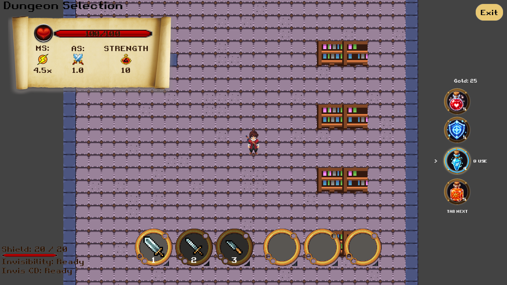

# Standalone consumable HUD integration

Related feature: [#197](https://github.com/UQcsse3200/2026-studio-4/issues/197).

The right-side circular consumable bar from the `items` branch is adapted to
`main`'s existing `ItemType`, `InventoryComponent` and `ConsumableEffectComponent`.
It can be merged independently of the item identity/drop refactor in PR #198.

## Controls and behavior

- All four slots start empty. New consumable types fill the first empty slot in
  pickup order; repeated pickups stack in the assigned slot. Using the last item
  clears that slot without moving other items, and later pickups reuse the first
  available gap.
- **Tab** cycles physical slots 1 through 4, including empty slots, then wraps to
  slot 1. The selected slot has a highlighted frame and pointer.
- **Q** requests use of the selected potion through the existing effect
  component. Its existing validation owns consumption: empty stock, full-health
  healing attempts and other rejected uses do not remove an item.
- Counts refresh from the existing `consumableInventoryChanged(ItemType, count)`
  event. Empty slots hide their icon, count and Q hint. Gold remains visible and
  follows the actual inventory balance.
- The blue arc follows Speed in whichever slot currently holds it and hides
  when that slot clears or holds another item. It follows the existing effect's remaining time,
  including refresh, expiry and status-effect removal.
- **7 / 8 / 9 / 0** are unbound and do not consume items or apply effects.
  Consumables use **Tab / Q** only.
  The weapon/spell hotbar and inventory book are unchanged.

The new display is mounted by `MainGameScreen`, and `PlayerFactory` adds the
selection component. The old `Team5CombatHudDisplay` is no longer mounted on the
game player. Its class and the old loadout remain available to existing callers.
Frame and icon textures belong to `ResourceService`; the HUD disposes only its
own stage actors and generated timer texture.

This change does not add Freeze Bomb, replace the item registry, change enemy
drops, add a shop, or implement the inventory book's consumables page. It completes
the HUD portion of #197 rather than closing the entire feature.

## Verification

```sh
cd source
./gradlew test spotlessCheck :desktop:compileJava --no-daemon
```

Initial HUD integration result on 2026-10-04: **1,322 tests in 193 suites; zero failures, errors or skipped
tests**. Formatting and desktop compilation passed.

Pickup-order update on 2026-10-04: `./gradlew test` passed **1,325 tests** with
zero failures, errors or skipped tests. Regression coverage checks Shield picked
first, duplicate stacking, clearing and reusing a gap without moving Strength,
Q using the displayed item, pickups made before player creation, and removed
7 / 8 / 9 / 0 bindings leaving stock and effects untouched. The updated
game also started successfully at the main menu.

Coverage exercises the real enum-based inventory and effect components:
quantity/visibility updates, successful and rejected Q use, four-slot selection
and wrapping, shield/speed/strength effects, speed arc refresh/expiry/removal,
Gold refresh, 1920×1080 / 1280×720 / 906×600 layouts and HUD replacement/disposal.
Input tests check that Tab/Q trigger requests on key-down only.

A temporary local LWJGL smoke harness also entered the actual `MainGameScreen`,
seeded five of each existing potion and 25 Gold, and sent Tab, Tab, Q through the
real `InputService`. It verified Speed selection, stock dropping from five to
four and a live speed effect, then captured the rendered scene below. The fixture
is verification setup, not a change to starting inventory. This does not replace
a full manual gameplay walkthrough.



For a manual walkthrough, start `./gradlew desktop:run`, enter gameplay, collect
potions with the existing pickup interaction, cycle with Tab and use with Q.
Check empty/full-health use, effect refresh/expiry, Gold pickups, inventory book
visibility and resizing. Confirm no duplicate old consumable HUD appears.

## Local ItemIds integration (2026-10-06)

The original HUD and pickup-order commits by Jeremyzihanwu are retained through a
merge of `origin/consumable-items`. The integration adapts their four physical slots
to the current ItemCatalog/String IDs, without reintroducing the retired ItemType
API or loadout component. Freeze Bomb and other registered consumables use the same
slot assignment and their catalog textures. Existing local consumable feedback and
the eight-second shield using the original Shield mitigation are retained.
The earlier verification counts above describe the original remote implementation.
