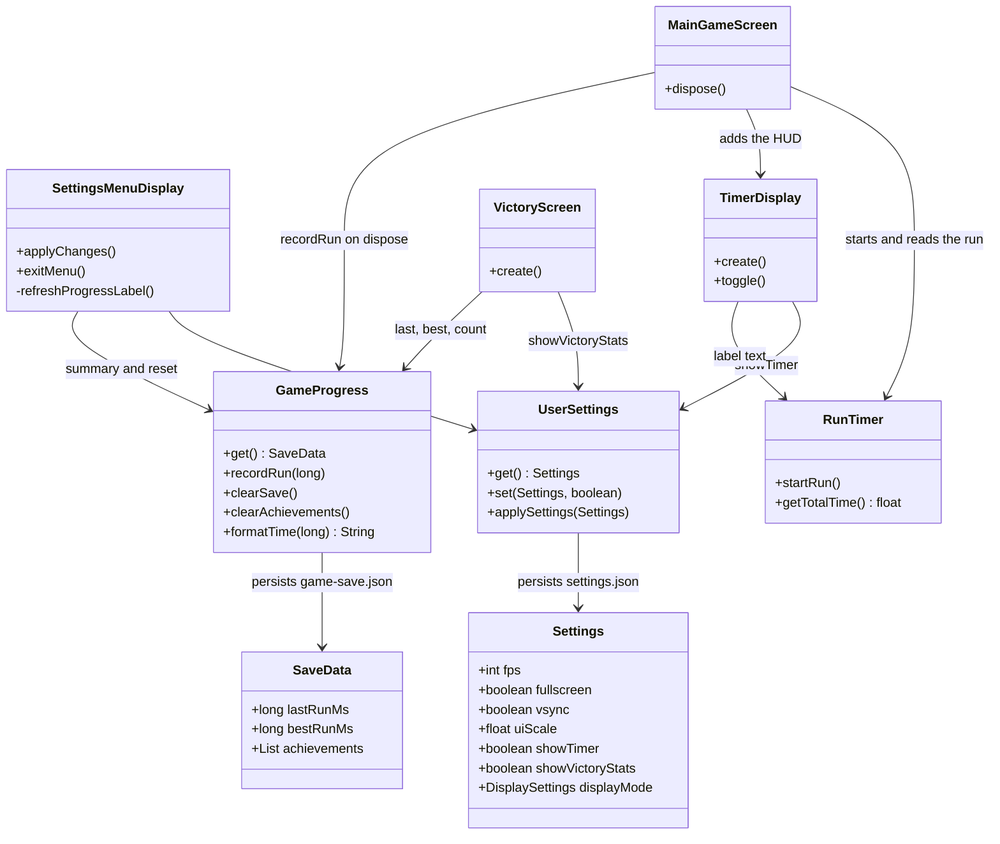
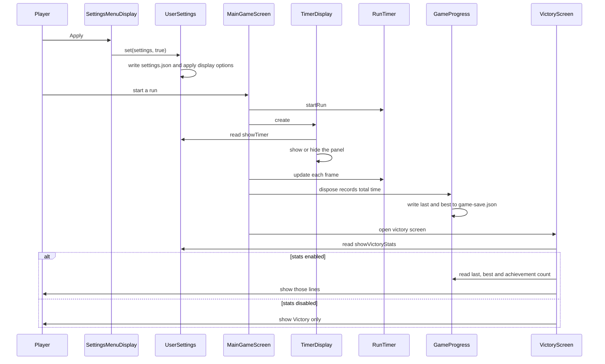
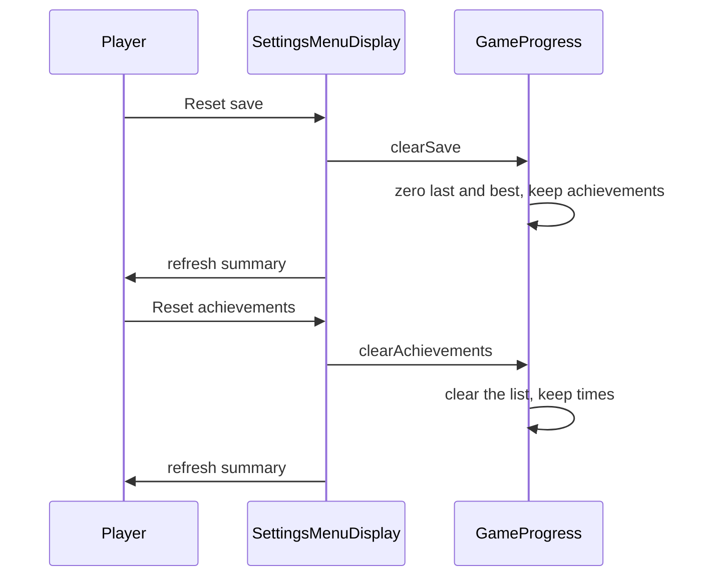

# Settings menu

Players open Settings from the main menu, change display and gameplay options, then press Apply or Exit. Apply writes `settings.json` through `UserSettings` and applies the display options immediately. Exit returns to the main menu and drops unsaved edits.

The gameplay section controls whether the in-run timer is shown, whether the victory screen lists last run, best run and achievement count, and lets the player reset those saved values. Reset save clears last and best times only. Reset achievements clears the achievement list only. The summary line on the settings screen updates after either reset.

The timer checkbox is read when `TimerDisplay` is created, so it takes effect on the next run. The victory checkbox is read when the victory screen is created.

## Class diagram



## Sequence diagram

Apply, then a finished run:



Reset from the settings menu:



## Tests

JUnit coverage lives next to the code:

- `UserSettingsTest` checks the gameplay options default to on and round-trip through `settings.json` without touching the display.
- `GameProgressTest` checks time formatting, best-run updates, one-time achievement unlocks, and that the two reset actions do not clear each other's data.
- `TimerDisplayTest` checks the HUD panel stays hidden when Show run timer is off.
- `VictoryScreenTest` checks the victory lines appear only when Show victory stats is on.

From `source/`:

```sh
./gradlew test --tests com.csse3200.game.files.UserSettingsTest --tests com.csse3200.game.files.GameProgressTest --tests com.csse3200.game.components.gamearea.TimerDisplayTest --tests com.csse3200.game.screens.VictoryScreenTest
```
