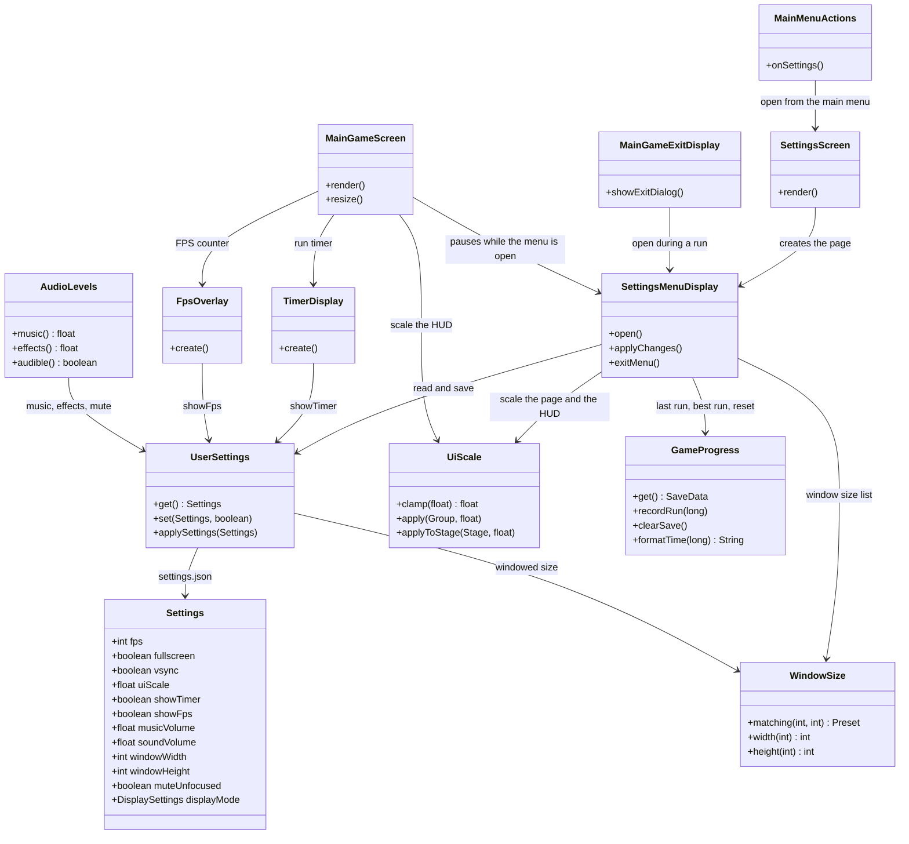
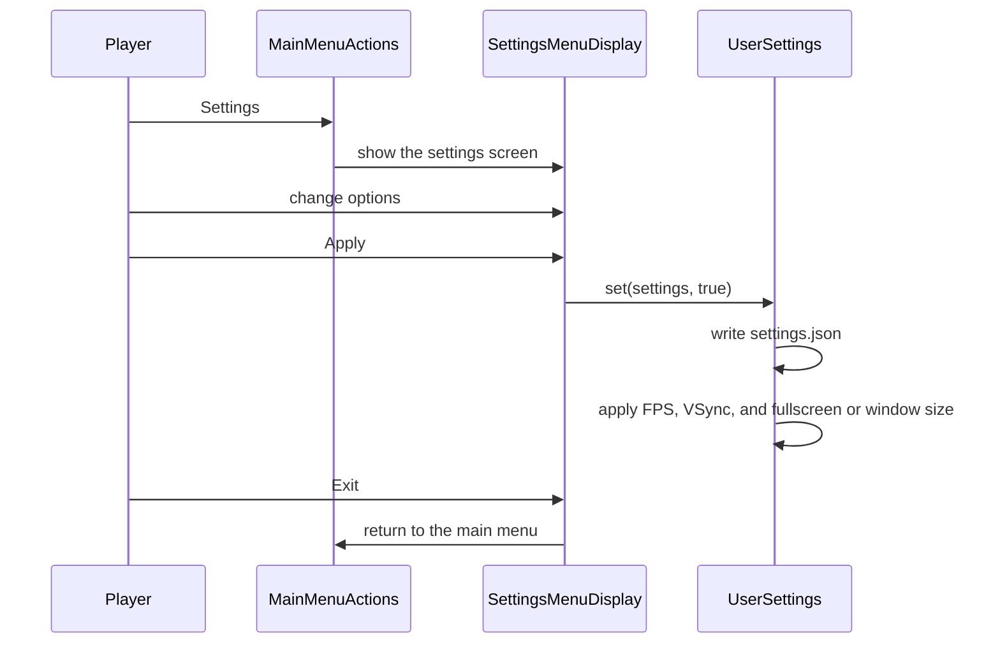
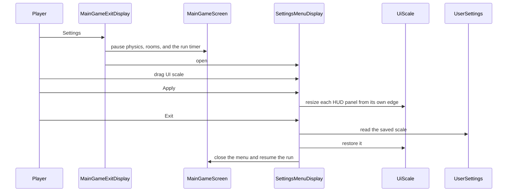
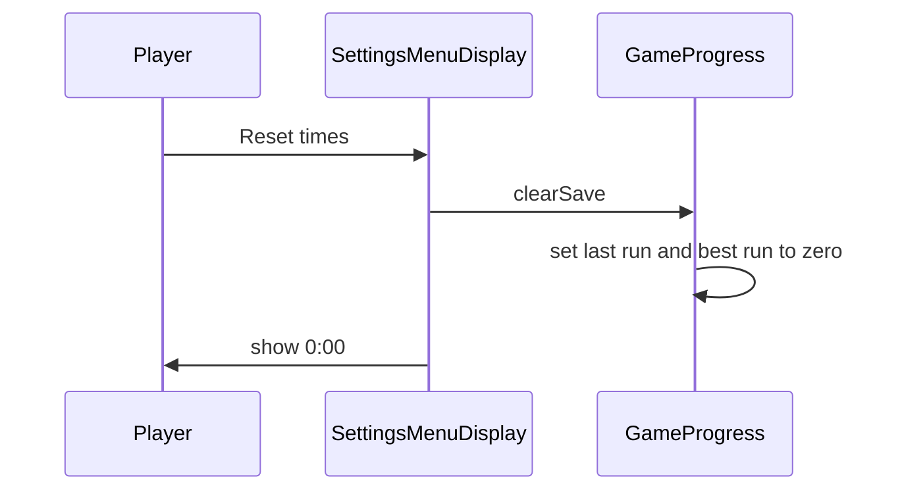

# Settings menu

Players can change display, audio, and gameplay options from the main menu, or from the Settings button beside Exit during a run. Apply saves the options and applies the display settings immediately. Exit throws away unsaved edits. From the main menu, Exit returns to the main menu. During a run, Exit closes the menu and returns to the same run. The run pauses while that menu is open.

The page has four sections: Display, Audio, Gameplay, and Run history. Achievements, online play, and the win screen are not part of this menu.

Saved options are written to `DECO2800Game/settings.json` under the home directory. Run times are written to `DECO2800Game/game-save.json`.

## How to use it

### From the main menu

1. On the main menu, press **Settings**.
2. Change the options you want.
3. Press **Apply** to save them, or **Exit** to leave them unchanged and return to the main menu.

### During a run

1. Press **Settings**, to the left of **Exit**.
2. The run pauses. Enemies and the run timer stop.
3. The game HUD is hidden while this menu is open. Change the options. **UI scale** is in the Display section and does not resize this menu. Press **Apply** and the HUD panels grow or shrink from the edge each one sits on. The smallest scale is 0.5×.
4. Press **Apply** to keep the changes, or **Exit** to drop them and continue the same run.

### What each control does

| Control | What it does |
| --- | --- |
| FPS cap | Limits how many frames the game draws per second. |
| Fullscreen | Turns fullscreen on or off. The resolution list is used only while fullscreen is on. |
| VSync | Matches the frame rate to the monitor. |
| Resolution | Fullscreen size and refresh rate. If nothing is selected, Apply keeps the current display mode. |
| Window size | Size of the window when fullscreen is off. Choices are 960×540, 1280×720, 1280×800, 1600×900, and 1920×1080. |
| UI scale | In the Display section, from 0.5× to 2×. The settings page stays the same size. The HUD changes after Apply. |
| Music | Background music volume, including the victory music. |
| Effects | Sound effect volume, including the death sound. |
| Mute in background | Silences music and effects while the window is not focused. |
| Show run timer | Shows or hides the run timer on the HUD. Apply updates the timer in the current run. |
| Show FPS | Shows or hides the FPS counter in the bottom-right corner. Apply updates it in the current run. |
| Last run / Best run | Times stored on this computer. Best changes only when a run is won. Saving and leaving does not replace it. |
| Reset times | Clears last run and best run. It does not clear achievements. |

## Class diagram



## Sequence diagram

Open from the main menu and save:



Open during a run. Exit keeps the run:



Reset the stored times:



## Tests

From `source/`:

```sh
./gradlew test --tests com.csse3200.game.components.settingsmenu.InGameSettingsTest --tests com.csse3200.game.components.settingsmenu.SettingsMenuDisplayTest --tests com.csse3200.game.ui.UiScaleTest --tests com.csse3200.game.files.UserSettingsTest --tests com.csse3200.game.files.WindowSizeTest --tests com.csse3200.game.files.AudioLevelsTest --tests com.csse3200.game.files.GameProgressTest --tests com.csse3200.game.components.gamearea.TimerDisplayTest
```

`InGameSettingsTest` checks that the in-game Settings button opens the menu, the world stops updating while it is open, UI scale changes the menu, and Apply and Exit stay at normal size.
