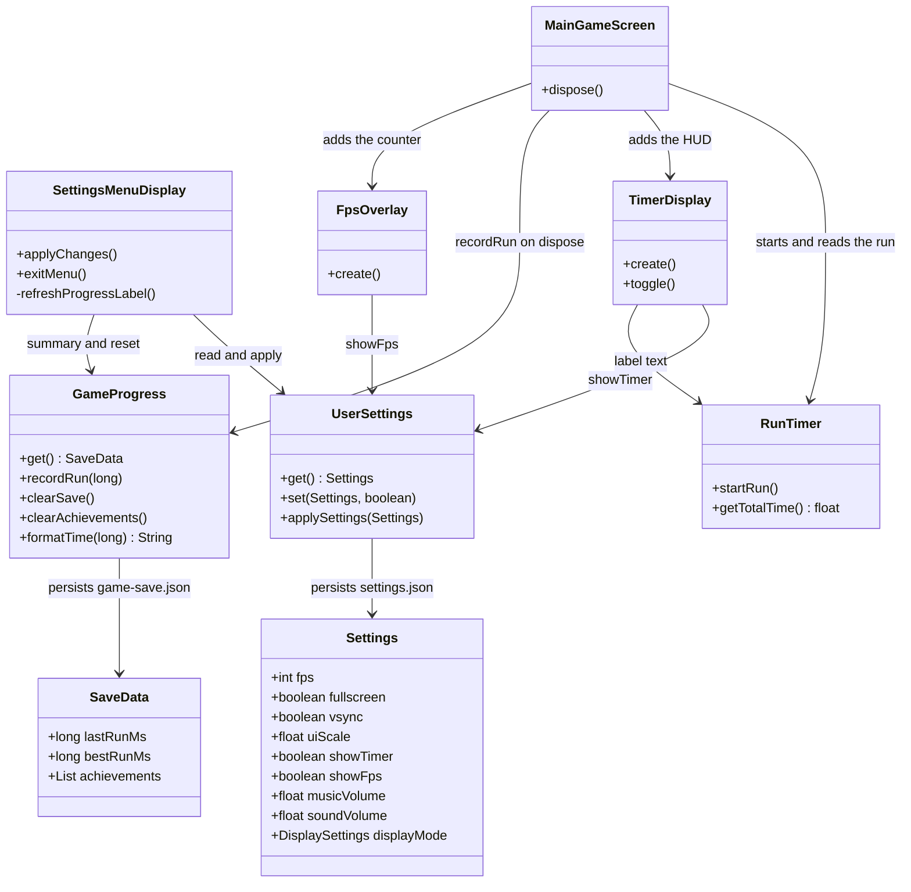
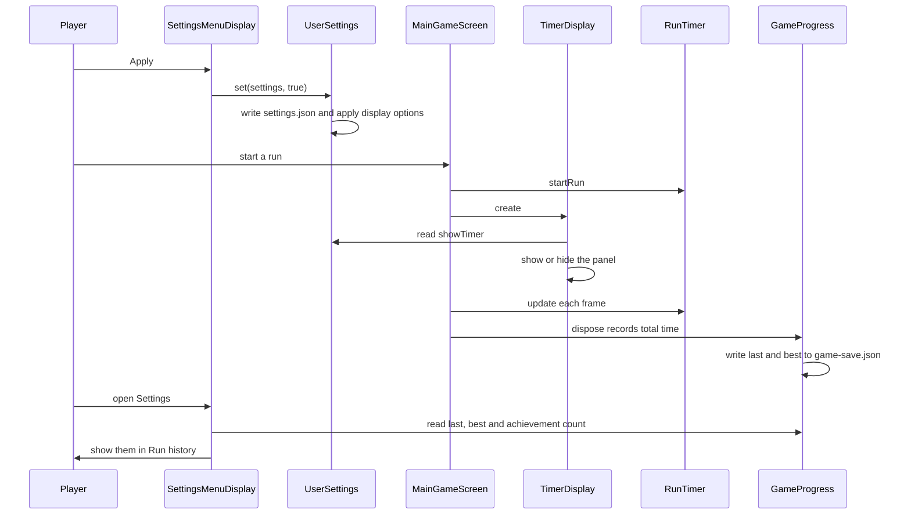
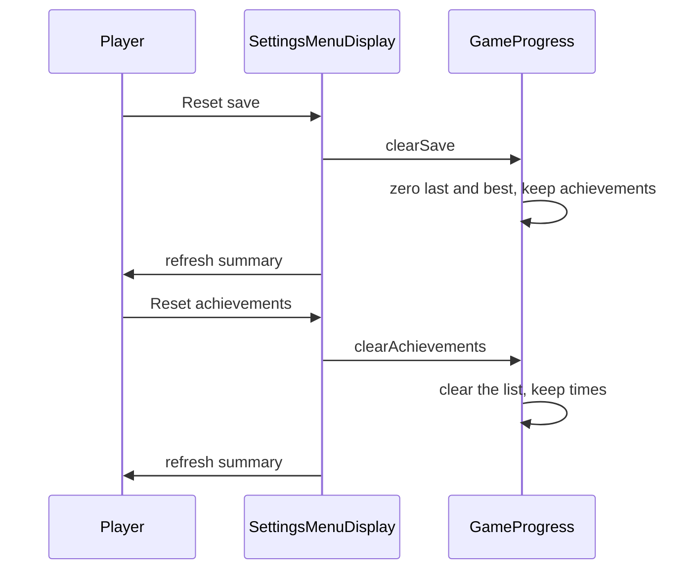

# Settings menu

Players open Settings from the main menu, change display and gameplay options, then press Apply or Exit. Apply writes `settings.json` through `UserSettings` and applies the display options immediately. Exit returns to the main menu and drops unsaved edits.

The menu has Display, Audio, Gameplay and Run history sections. Gameplay controls the in-run timer and a small FPS counter. Audio stores music and effects volume. Run history lists last run, best run and achievement count on this settings page, and can reset those values separately. The win screen is not part of this menu.

## Class diagram



## Sequence diagram

Apply, then a finished run:



Reset from the settings menu:



## Tests

JUnit coverage lives next to the code:

- `UserSettingsTest` checks the gameplay options default to on and round-trip through `settings.json` without touching the display.
- `GameProgressTest` checks time formatting, best-run updates, one-time achievement unlocks, and that the two reset actions do not clear each other's data.
- `TimerDisplayTest` checks the HUD panel stays hidden when Show run timer is off.
- `AudioLevelsTest` checks music and effects volumes stay inside 0 to 1.

From `source/`:

```sh
./gradlew test --tests com.csse3200.game.files.UserSettingsTest --tests com.csse3200.game.files.GameProgressTest --tests com.csse3200.game.files.AudioLevelsTest --tests com.csse3200.game.components.gamearea.TimerDisplayTest
```
