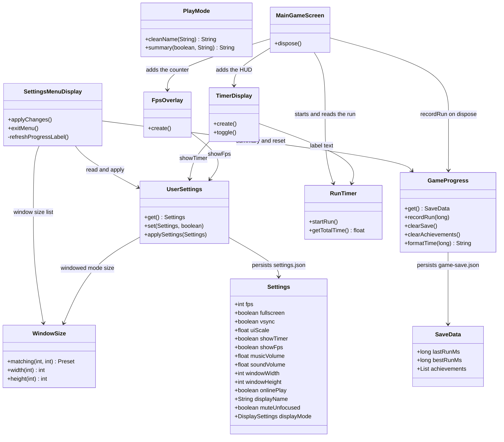
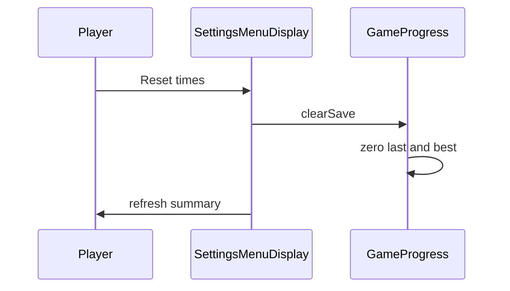

# Settings menu

Players open Settings from the main menu, or from the Settings button beside Exit during a run. Apply writes `settings.json` through `UserSettings` and applies the display options immediately. Exit on the main-menu page returns to the main menu. Exit during a run closes the menu and returns to the same run. Either Exit drops unsaved edits. The run pauses while the in-game menu is open.

The menu has Display, Audio, Gameplay and Run history sections. Display includes the fullscreen resolution, the window size used when fullscreen is off, and a UI scale. The UI scale slider stays on the bottom bar, next to Apply and Exit, so those controls stay on screen at any size. Dragging it resizes the rest of this menu from the top. During a run each HUD panel grows from the edge it sits on, instead of the whole screen scaling around the centre. Apply stores it. Gameplay controls the in-run timer and a small FPS counter in the bottom-right corner. Audio stores music and effects volume, and can mute both while the window is in the background. Run history lists last run and best run on this settings page, and can reset those times. Achievements, online play and the win screen are not part of this menu.

## Class diagram



## Sequence diagram

Apply, then a finished run:


Reset from the settings menu:



## Tests

JUnit coverage lives next to the code:

- `UserSettingsTest` checks the gameplay options default to on, window size is applied when fullscreen is off, and the new options round-trip through `settings.json` without touching the display.
- `WindowSizeTest` checks listed sizes, the default window, and clamping.
- `PlayModeTest` checks the display name and the online status line.
- `GameProgressTest` checks time formatting and best-run updates. The settings page does not list or reset achievements.
- `TimerDisplayTest` checks the HUD panel stays hidden when Show run timer is off.
- `AudioLevelsTest` checks music and effects volumes stay inside 0 to 1, and that mute-in-background silences an unfocused window.

From `source/`:

```sh
./gradlew test --tests com.csse3200.game.files.UserSettingsTest --tests com.csse3200.game.files.WindowSizeTest --tests com.csse3200.game.files.PlayModeTest --tests com.csse3200.game.files.GameProgressTest --tests com.csse3200.game.files.AudioLevelsTest --tests com.csse3200.game.components.gamearea.TimerDisplayTest
```
