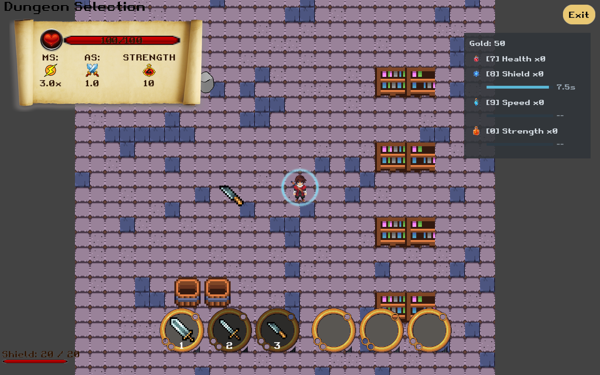
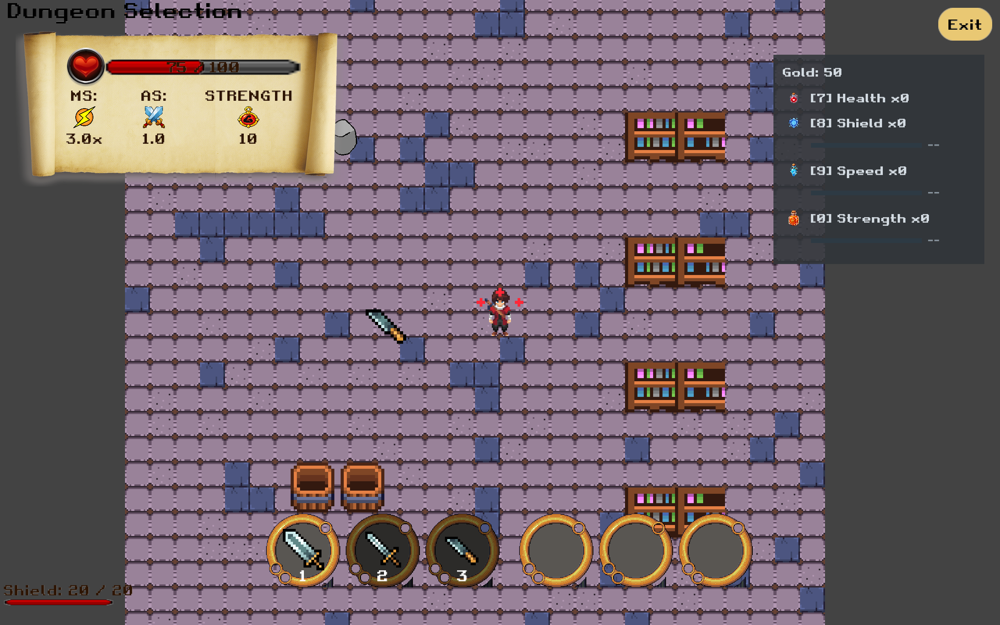

# Team 5 consumable world feedback

Local task branch: `task/115-consumable-world-effects`, based on items `4b5e7c2`.

## Implemented behaviour

- Successful Health Potion use emits three red plus signs around the player. They rise and fade over 1.2 seconds, following the player's position. Repeated successful healing restarts the bounded three-sign burst.
- An active consumable Shield displays a cyan circular barrier with brighter rotating arcs and a soft pulse. The ring follows the player, reflects refreshed duration, fades during the last 450 ms, and disappears on expiry or early removal.
- Healing listens only to `itemUsed` success notifications. Failed use at full HP or without stock produces no success VFX. The visual component never consumes inventory or applies stats.
- Shield visibility queries the real ConsumableEffectComponent, so its duration is not duplicated in a separate VFX timer.
- Death hides the effects; disposal unregisters the renderer and releases its procedural textures. No third-party artwork is required.
- This uses the existing world rendering pipeline and leaves the shared Team 2 HUD and Charm-count decision unchanged.

The same effects component underlies keyboard use and the separate backpack integration branch. This branch does not include that backpack branch or the health-lock demo.

## Review and evidence

Automated checks exercise successful/failed healing, exactly three draw calls, expiry, shield refresh/early removal, death and preservation of the SpriteBatch colour. Full suite: 950 tests, 0 failures, 0 errors, 0 skipped. Spotless check passed. Log: `/tmp/team5-consumable-vfx.log`. Automated rendering assertions do not constitute a visual playtest.

Suggested manual check: collect a Health Potion and Shield, take damage, press 7 for the three plus signs, press 8 for the moving barrier, re-use Shield before expiry, and verify the ring and HUD timer end together. Full HP and empty stock must show no success animation.

## Worth recording for the final Wiki

- Separate each member's original contribution from Yuezhou's integration and visual enhancements.
- Demonstrate actual successful use, stock decrement and visible feedback in one short recording.
- Record the final 7/8/9/0 interface and the shared success event, rather than old selection/U instructions.
- Future optional polish: quiet success sound; distinct Speed/Strength feedback; clear empty-stock/full-health feedback outside the backpack. These are ideas, not completed work.

Codex assisted implementation and tests under Yuezhou Wang's direction. No remote publication is implied.

## Runtime screenshots — 2026-09-17

Captured from the actual desktop game renderer at implementation commit `0e34305`, using a temporary local capture launcher. The launcher opened MainGameScreen, preloaded one Shield and one Health Potion, and used the real ConsumableEffectComponent.tryUse entry point. For the healing capture it cleared the shield, set HP to 50, then consumed one Health Potion: the screenshot shows 75/100 HP and three plus signs. These are staged visual demonstrations, not evidence of the full enemy-drop/pickup flow. The capture launcher is outside the repository and is not shipped.

