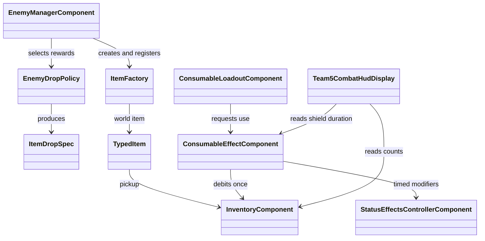
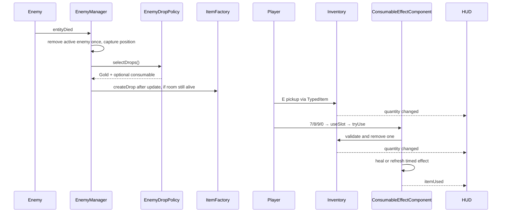

# Consumable Items, Currency and Combat HUD — Sprint 2

Local publication draft, updated 2026-09-16. This file is not a claim that the Wiki or remote items/main has been updated.

## Player guide

Defeated tracked enemies drop **5 Gold**, and independently have a **35% chance** to drop one consumable. Each of Health, Shield, Speed and Strength has equal probability within that 35%. The values are initial tuning defaults, not a claimed cross-team balance decision. Gold is picked up rather than immediately credited. Stand within pickup range and press **E**; each press collects one nearby entity. If Gold and a potion overlap, collect both with two presses.

All four consumables stack in inventory. The compact top-right Team 5 panel shows Gold and one row per item, with its world-item icon, fixed key and current stock. Press **7** for Health, **8** for Shield, **9** for Speed, or **0** for Strength. There are no Change buttons or Last used label. Empty stock cannot be used. Keys **1–3** still select weapons, **K** still performs the weapon heavy attack, and **I** still opens the existing inventory.

The Shield row includes a horizontal duration bar and seconds remaining, read from the actual active consumable effect. Successful use fills it for 8 seconds; another successful use refreshes it. It empties at expiry or early removal, even before the status controller's next update. This is duration, not absorb points, and is separate from Team 2's existing shield-point HUD.

| Item | Successful use |
|---|---|
| Health Potion | Restores up to 25 HP, capped at maximum health. At full health, consumes nothing. |
| Shield | Blocks damage routed through the shared damage/status pipeline for 8 seconds. Does not conceal the player or overwrite other invulnerability. |
| Speed Potion | Multiplies effective movement speed by 1.5 for 8 seconds. |
| Strength Potion | Multiplies effective attack by 1.5 for 8 seconds. |

Repeated use of the same timed consumable refreshes its duration, without multiplying that consumable's bonus again. Different status effects compose through the existing controller. Permanent Strength Charm changes remain in raw attack and survive expiry. Timers use the registered `GameTime` like the shared abilities system; this currently measures elapsed time, so opening an inventory does not promise to pause effect deadlines.

The fixed four-key mapping follows Yuezhou's playtest request on 2026-09-16 and supersedes the earlier three configurable slots. No announcement or acceptance by other teams is implied. The separate Team 5 panel does not implement Team 4's full inventory book or replace its spell frames.

## Contracts and ownership

- `InventoryComponent` owns quantities and Gold. Quantity changes emit `consumableInventoryChanged(ItemType, count)`.
- `ConsumableLoadoutComponent` defines four fixed slots (Health, Shield, Speed, Strength); `getSlot(index)` exposes their types.
- Keyboard input calls `useSlot(index)`. `ConsumableEffectComponent.tryUse(type)` or `useConsumable(ItemType)` requests use.
- **Only ConsumableEffectComponent removes the item on a successful use.** Input and HUD never debit inventory. `itemUsed(ItemType)` is a notification after success, not another request.
- Temporary modifiers use the existing `StatusEffectsControllerComponent`, `TimedStatusEffect`, `Stat`, and `Damageable` interfaces. No shared combat implementation was changed for these consumables.
- `EnemyDropPolicy` selects immutable `ItemDropSpec` values. Constructor parameters configure Gold, probability and random generator; tests inject deterministic randomness.
- `ItemFactory` creates item entities and remains independent of drop probability.
- `EnemyManagerComponent` accepts one defeat per active tracked enemy, captures the death position, queues generation safely after updates, and owns registration/disposal. Pending rewards are cancelled if their room manager has been disposed.
- The main-branch `createRandomDrop` interface remains available for callers using its Charm pool. Normal enemy rewards use `EnemyDropPolicy` instead, to guarantee currency and allow consumables.
- Final Boss encounter completion and ordinary death share the same reward guard; receiving both events cannot pay twice.
- Split parents replaced by children are no longer active tracked enemies; later parent death callbacks do not award duplicate rewards. Their tracked children follow the normal policy. No additional boss-phase reward or special mini-boss Gold bag has been invented.





## Verification

Commands from `source/`:

```sh
./gradlew --offline spotlessCheck core:test core:javadoc
```

Meaningful regression coverage includes:

- actual enemy death → real factory entities → pickup fixtures → Gold/stock → Scene2D HUD → keyboard → healing → zero remaining stock;
- one and two potion inventories, repeated empty use, full-health rejection, invalid/dead/disposed use;
- real damage during Shield and at the exact expiry boundary;
- Strength refresh, Charm pickup during the effect, preserving raw values on expiry;
- Speed combined with another status multiplier;
- fixed Strength key, visible count changes, shield progress at half duration, refresh, expiry and early removal;
- all four random selections, 0%/100% chance, probability boundary, reproducible seeded policies;
- duplicate tracking/death events, captured death position, room disposal before deferred generation, drop registration/disposal;
- HUD removal when replacing the player, existing inventory/charm/factory and shared input regressions;
- final Boss completion/death events in either order and coexistence with Team 4 hotbar at three window sizes.

See `team5-sprint2-integration-verification.md` for tested commits, actual results and remaining visual verification limits. Earlier HUD and input work is retained in Git history; the current contract supersedes the old 1–4 selection plus U design and deterministic demo drops.

## Attribution and scope

This integration retains Sumith's inventory, Aarash's effects foundation, Jeremy's HUD work, Dev's input branch history, and Yuezhou's item/factory foundation. Codex assisted with implementation, integration and testing under Yuezhou's direction. Shop, saving inventory across game sessions, full inventory-book interaction, and special boss-phase rewards are outside this delivery.
