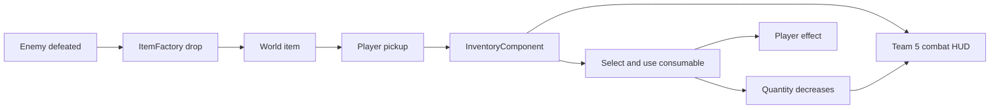

# Consumable Items, Currency and Combat HUD — Sprint 2

> **Status:** This page describes Team 5's verified Sprint 2 implementation and the integration boundaries agreed with Teams 2 and 4 as of 13 September 2026.

## Overview

Sprint 2 extends the Sprint 1 item pipeline with four consumable types and Gold currency:

- Health Potion
- Shield
- Speed Potion
- Strength Potion
- Gold Coin

The intended player flow is:



Gold and consumables use the same underlying inventory state as the rest of the game. The Team 5 combat HUD is an always-visible quick bar; it is not a replacement for the complete inventory screen or the shared Player HUD.

## Implemented components

### Item types and drop contract

`ItemType` defines the supported Sprint 2 item types and their display names, descriptions, textures and categories. The four potions are classified as `CONSUMABLE`, while Gold is classified as `CURRENCY`.

`ItemDropSpec` carries the caller-selected item type and quantity. `ItemFactory` creates a new world entity for the requested drop but leaves registration and lifecycle ownership to the caller. This keeps enemy, room and boss systems responsible for when and where drops enter the world.

### Consumable inventory

`InventoryComponent` stores each consumable quantity separately using `ItemType` keys.

The main operations are:

```java
int getConsumableCount(ItemType type)
boolean hasConsumable(ItemType type)
void addConsumable(ItemType type)
boolean removeConsumable(ItemType type)
```

Adding and successfully removing a consumable emits:

```text
consumableInventoryChanged(ItemType type, int newCount)
```

Invalid, null and non-consumable item types are ignored by the consumable inventory operations.

### Team 5 combat HUD

`Team5CombatHudDisplay` is a separate UI component attached to the player. It displays:

- the current Gold total;
- Health Potion quantity on slot 1;
- Shield quantity on slot 2;
- Speed Potion quantity on slot 3;
- Strength Potion quantity on slot 4; and
- the currently selected consumable when a selection event is provided.

Initial quantities are read from `InventoryComponent`, so the HUD does not assume that the inventory starts empty. Later inventory changes update only the matching consumable slot through `consumableInventoryChanged`.

Gold currently uses a read-only inventory check during HUD updates because the shared inventory code does not yet publish a confirmed Gold-change event. This avoids changing another member's component contract while keeping the displayed value correct.

The HUD accepts the agreed selection interface:

```text
selectedConsumableChanged(ItemType type)
```

The final input/use component is responsible for publishing this event when the player changes selection.

## Integration boundaries

### Team 2 — shared Player HUD

Team 2 owns the shared HUD presentation, including the HUD shell, Health display, Player stats, interaction prompts, shared visual assets and overall visual consistency. Team 2 confirmed that Team 5 may keep a separate basic Gold/consumable combat-HUD prototype and that Team 2 will later align the sprites and remaining Player HUD presentation with the game.

Team 5 does not modify or replace `PlayerStatsDisplay`, the Health bar, interaction prompts or Team 2's shared HUD lifecycle.

### Team 4 — complete Inventory UI

Team 4 owns the full Inventory UI, including inventory navigation, item management, sorting and detailed Currency/Consumables pages. Team 5's component is only the compact always-visible combat quick bar. Both presentations should read the same `InventoryComponent` state.

### Team 5 responsibilities

| Area | Owner |
|---|---|
| Item types, factory and reusable drop contract | Yuezhou |
| Consumable inventory and stacking | Sumith |
| Consumable effects | Aarash |
| Pickup, selection and use input | Devendera |
| Combat HUD, cross-component integration tests and documentation | Zihan |

Each member owns the unit tests for their component. Zihan owns cross-component verification after the required Team 5 components are available together.

## Event and data contracts

| Contract | Producer | Consumer | Purpose |
|---|---|---|---|
| `getGold()` | `InventoryComponent` | Team 5 combat HUD | Read current currency |
| `getConsumableCount(ItemType)` | `InventoryComponent` | HUD and Inventory UI | Read one consumable stack |
| `consumableInventoryChanged(ItemType, int)` | `InventoryComponent` | Team 5 combat HUD | Refresh the changed slot |
| `selectedConsumableChanged(ItemType)` | Selection/input component | Team 5 combat HUD | Highlight the selected item |
| `itemPickup` | Player input | Item pickup component | Keep item pickup separate from room interaction |

An active-effect indicator and duration display are optional enhancements and are not required for the basic Gold, quantity and selection HUD.

## Testing and verification

The Team 5 HUD test suite currently verifies:

- Gold and slot text formatting, including non-negative display values;
- all four `ItemType` to HUD-slot mappings;
- rejection of Gold, Strength Charm and null as consumable selections;
- consumable-inventory events updating the correct HUD slot;
- selection events updating the selected-consumable display;
- real `InventoryComponent` additions and removals producing HUD updates; and
- Gold being read from the player's actual inventory.

Current local verification on JDK 21:

```bash
./gradlew spotlessCheck
./gradlew test --tests com.csse3200.game.components.player.Team5CombatHudDisplayTest
./gradlew test
```

- Team 5 HUD tests: **9/9 passed**.
- Full Gradle test suite: **passed**.
- `spotlessCheck`: **passed**.
- Desktop smoke test: the game launched, entered the main game and exited normally.

The remaining end-to-end verification should cover:

1. Enemy defeat creates the configured Gold and/or consumable drop.
2. Player pickup adds the correct quantity to `InventoryComponent`.
3. The HUD updates the correct Gold or consumable value.
4. Player selection updates the selected-consumable indicator.
5. Player use applies the intended effect and decreases the stack by one.
6. Room transitions do not duplicate HUD actors or reset valid inventory state.
7. Sprint 1 Strength Charm behaviour continues to pass regression testing.

## User-facing behaviour

During normal gameplay, the player can see Gold and the quantities assigned to slots 1–4 without opening the full Inventory UI. Quantity changes should appear after pickup or use. When the input component publishes a selection change, the quick bar identifies the selected consumable.

The full Inventory UI remains the place for detailed inventory management. Health, Player stats and interaction prompts remain part of the shared Player HUD.

## Current integration notes

- The inventory count API and `consumableInventoryChanged` event are connected to the Team 5 HUD.
- Gold display reads the existing inventory value without introducing an unapproved shared event.
- The HUD is ready to consume `selectedConsumableChanged`; the final event producer must come from the pickup/use-input implementation.
- The complete enemy-drop-to-use flow must be rerun after the final pickup/input and effect components are integrated.
- The HUD layout must be visually rechecked after Team 2's updated Player HUD is merged.

## Related work

- [Feature #115 — Consumable Items & Currency System](https://github.com/UQcsse3200/2026-studio-4/issues/115)
- [Task #117 — Team 5 Combat HUD, Integration Testing and Documentation](https://github.com/UQcsse3200/2026-studio-4/issues/117)
- [Feature #98 — Team 2 HUD](https://github.com/UQcsse3200/2026-studio-4/issues/98)
- [Feature #95 — Team 4 Inventory Overhaul + UI](https://github.com/UQcsse3200/2026-studio-4/issues/95)
- [Task #116 — Consumable Effects](https://github.com/UQcsse3200/2026-studio-4/issues/116)
- [Sprint 1 — Item Drop, Pickup and Strength Charm](https://github.com/UQcsse3200/2026-studio-4/wiki/Item-Drop,-Pickup-and-Strength-Charm-%E2%80%94-Sprint-1)

## AI assistance

OpenAI Codex assisted Zihan with organising verified repository information, cross-checking component boundaries, drafting documentation and preparing HUD tests. Technical claims were checked against the integrated code, local test results and the agreed cross-team ownership boundaries.
