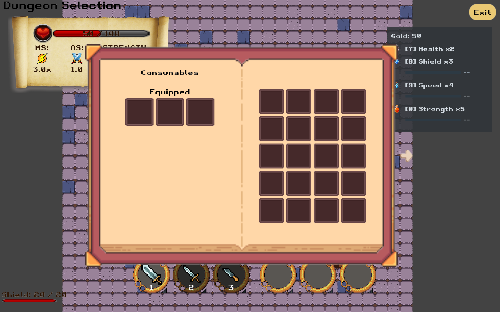
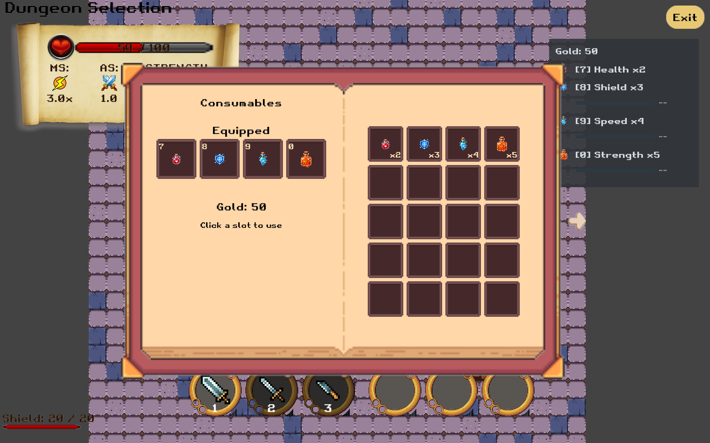

# Team 5 inventory data integration — local review branch

Base: local items `4b5e7c2`; branch: `task/115-inventory-data-integration`.

The existing Team 4 inventory book is already in main `9625e56` and items. This branch binds that merged UI to the real player rather than importing the unmerged `team4/inventoryUI` or `task/inventory-tooltips` implementations.

## Player-visible changes

- I opens the existing book, initially on its Consumables page; the existing arrow still switches to Charms.
- Gold and the four consumable stack counts read the same InventoryComponent used by the combat HUD.
- Team 4’s original book artwork, headings and 4 × 5 stock grid are retained. The Equipped row expands from three to four original-style slots, with fixed keys 7/8/9/0 and click-to-use. Actual stack counts appear on the first four stock cells; compact timers appear beneath the equipped slots.
- Use delegates to ConsumableEffectComponent.tryUse, which owns validation, the single inventory decrement, the effect and the success notification. The book never decrements inventory itself.
- Empty inventory, dead players and full-health healing attempts cannot consume a potion.
- Shield, Speed and Strength show actual active-effect time. Health is instant.
- Opening again, flipping pages and UI-stage updates refresh the values even when gameplay entity updates are paused by the existing inventory flow.

## Scope and coordination

Yuezhou explicitly requested an isolated local branch to connect the already-merged backpack UI. The branch remains separate from items for review, with a main-targeted PR prepared for user review before publication.

The Charm page is unchanged. No Charm-count restoration, new Charm management, item discard/world drop, weapon management, tooltip integration or three-slot equipment system is claimed. These require coordination with Team 4's in-progress UI work. Existing fixed direct-use keys remain unchanged.

The existing game-time semantics during inventory pause are retained; this branch does not implement a new pause clock.

## Validation

`./gradlew --offline spotlessCheck core:test`

Result: 949 tests, 0 failures, 0 errors, 0 skipped; formatting passed. Latest grid revision validation: `/tmp/backpack-grid-tests.log`; formatting: `/tmp/backpack-grid-format.log`.

Regression coverage includes real stock -> button -> healing/temporary effect -> exactly one decrement, full-health rejection, empty buttons, gold refresh, reopen/flip behaviour, actor cleanup and stage refresh while the UI component is disabled. Existing book layout and project regression tests are included.

Local framebuffer captures compare items, the previous text-list adaptation and the restored grid at `/Users/yuri/CSSE3200/inventory-comparison-2026-09-17/`. A temporary external launcher seeds 2/3/4/5 consumables and 50 HP for these captures; it is not production code. Both local builds were launched and the Consumables page inspected. User visual approval is still pending.

OpenAI Codex assisted implementation and tests under Yuezhou Wang's direction.

## Visual comparison

The screenshots use the same temporary fixture: 50 HP and consumable counts 2/3/4/5. The original items book does not display that stock yet.

## Integration refresh — 2026-09-17

Synced locally with items `0c7f3b0`, including main `9182adb` and restoration of the shared random Charm drop pool. The other independent Team 5 feature branch is not included. Earlier screenshots show the feature before this baseline refresh.
